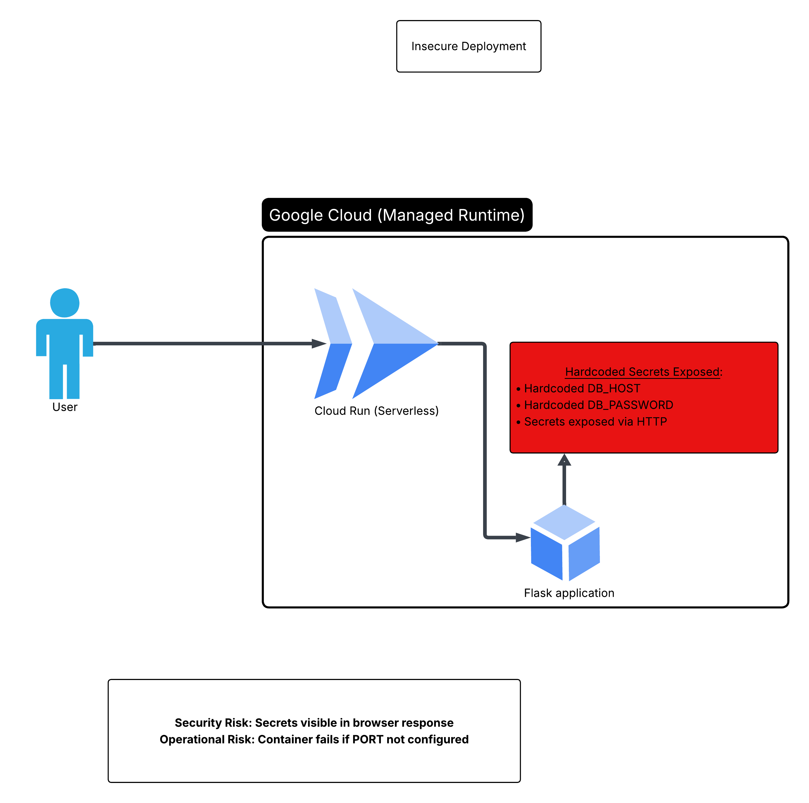

# Secure Cloud Run Flask Application
## Architecture Overview
- This project demonstrates the transformation of an intentionally insecure cloud-native application into a secure, observable, and scalable architecture using Google Cloud managed services.
- The initial version of the application intentionally demonstrated common cloud anti-patterns, including hardcoded secrets, exposed credentials via HTTP responses, and lack of observability. These issues were then systematically identified and remediated using cloud-native best practices.
  
## Architecture Diagrams
### Initial Insecure Architecture
*(Intentionally insecure deployment highlighting common cloud anti-patterns)*

### Secure Cloud-Native Architecture
*(Hardened architecture using Secret Manager, IAM least privilege, and observability)*

## Live Deployment Proof (Google Cloud)

This application is deployed live on Google Cloud using a fully managed serverless architecture.

- Platform: Google Cloud Run (europe-west1)
- CI/CD: GitHub → Cloud Build → Cloud Run
- Container: Docker
- Runtime: Python (Flask)
- Port configuration: Uses $PORT as required by Cloud Run
- Scaling: Auto-scaling enabled with scale-to-zero
- Observability: Cloud Logging enabled and verified

The deployment was validated by:
- Successful Cloud Build pipeline execution
- Active Cloud Run service with public URL
- Verified request logs in Cloud Logging

## Before vs After Comparison

The table below summarizes the architectural improvements made during the
transition from the initial insecure deployment to the hardened cloud-native
architecture.

| Area | Before (Insecure) | After (Secure) |
|----|------------------|---------------|
| Secrets Management | Hardcoded in source code and exposed via HTTP responses | Stored in Google Secret Manager and accessed at runtime |
| IAM & Access Control | Default permissions with no access restrictions | Dedicated service account with least-privilege access |
| Configuration | Static configuration embedded in application code | Environment-based configuration managed by Cloud Run |
| Observability | No logging or monitoring | Cloud Logging and Cloud Monitoring enabled |
| Deployment | Manual and error-prone | Automated CI/CD using Cloud Build |
| Scalability | Implicit and unmanaged | Serverless autoscaling with Cloud Run |
| Security Posture | High risk of credential exposure | Production-aligned cloud security best practices |

## High-Level Architecture
- The application is deployed on Google Cloud Run, a fully managed serverless compute platform. Deployment is automated through a CI/CD pipeline using Cloud Build, with source code hosted in GitHub.
- At runtime, the application retrieves sensitive configuration values from Google Secret Manager rather than storing them in source code. Access to secrets is tightly controlled using a least-privilege IAM service account assigned to the Cloud Run service.

## Threat Model
This section highlights key security threats identified in the initial deployment
and the mitigations applied in the hardened architecture.

| Threat | Risk | Mitigation | GCP Service |
|------|------|------------|------------|
| Hardcoded secrets | Credential leakage | Store secrets securely and access them at runtime | Secret Manager |
| Secrets exposed via HTTP | Data breach / incident | Never return secrets in responses; restrict access | Secret Manager + App code |
| Over-privileged access | Unauthorized resource access | Dedicated service account with least privilege | IAM |
| Misconfigured runtime/port | Service outage | Bind to `0.0.0.0` and read `PORT` env var | Cloud Run |
| Lack of observability | Slow incident response | Centralized logs and metrics | Cloud Logging / Monitoring |
| Manual deployments | Drift & human error | Automated CI/CD | Cloud Build |

## Observability

- Centralized logs using Google Cloud Logging
- Error simulation via `/crash` endpoint
- Latency simulation via `/slow` endpoint
- Logs used for debugging and incident response

## Security

- Cloud Run service secured with IAM authentication
- Unauthenticated access disabled
- Service-to-service access enforced via IAM

## Identity and Access Management

- Dedicated service account used by Cloud Run
- Least-privilege permissions applied
- Access limited to Secret Manager only

## Core Components
### Cloud Run (Serverless Runtime)
- Hosts the Flask application
- Automatically scales based on incoming traffic
- Scales to zero when idle to reduce cost
- Reads the application port from the PORT environment variable as required by Cloud Run

### Cloud Build (CI/CD)
- Builds and deploys the container image automatically
- Triggered from source control (GitHub)
- Ensures consistent, repeatable deployments

### Secret Manager
- Stores sensitive values such as database hostnames and passwords
- Secrets are accessed at runtime only
- No secrets are hardcoded or exposed in application responses

### Identity and Access Management (IAM)
- Cloud Run uses a dedicated service account
- Granted only secretmanager.versions.access
- Follows the principle of least privilege

### Logging and Monitoring
- Cloud Logging captures application and request logs
- Cloud Monitoring provides metrics and visibility into runtime behavior
- Enables faster debugging and operational awareness

## Security Improvements
- The secure architecture addresses the following risks:
- Secret exposure → Mitigated using Secret Manager and IAM
- Misconfigured container ports → Resolved using environment-based configuration
- Lack of observability → Resolved using built-in logging and monitoring
- Over-privileged access → Resolved using least-privilege service accounts

## Architectural Outcomes
- Secrets are never exposed to end users
- The application follows cloud-native security best practices
- The system is scalable, observable, and cost-efficient
- The architecture is production-aligned and interview-ready
